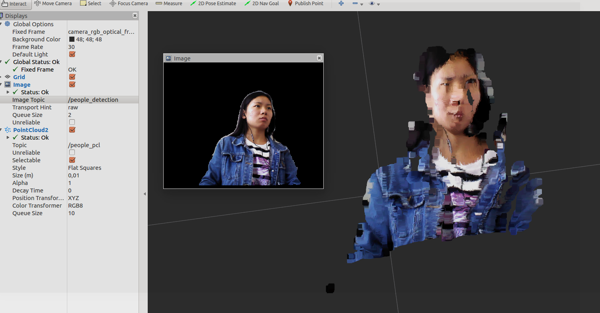

# people_pcl

This is a rospkg to realize the people detection , masked people picture and generate pointcloud with rgb image and depth image. And the Result seems like 0.12s for one masked people_detection and 0.35 s to generate one pointcloud (one picture 480*640)




#Installation
First, tensorflow should be installed on your system.

Then,
```sh
$ cd && mkdir -p catkin_ws/src && cd catkin_ws
$ catkin_make && cd src
$ git clone --recursive https://github.com/Inaaa/people_pcl.git
$ git clone https://github.com/cagbal/cob_perception_common.git
$ cd ~/catkin_ws
$ catkin_make
```
##Running
For running people_detection

```sh
$ roslaunch people_pcl people_detection.launch
```
If you also want to get people_detection and generate pointcloud,

```sh
$ roslaunch people_pcl people_pcl.launch
```


